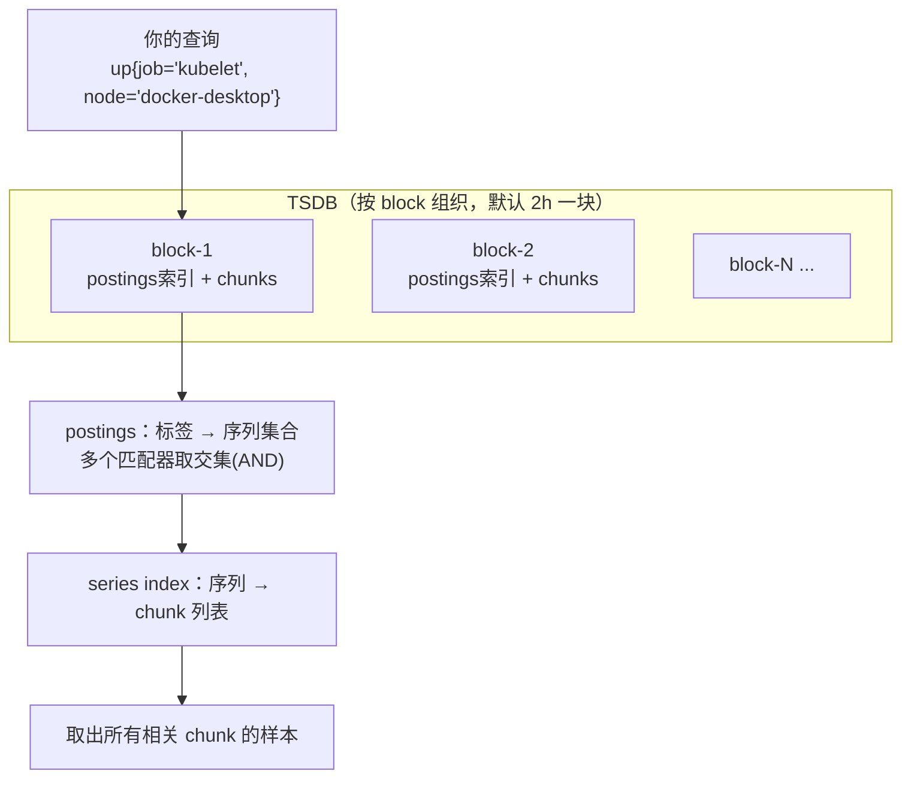

## PromQL 是什么、不是什么

PromQL（Prometheus Query Language）是 Prometheus 的查询语言：

1. **它只读**。不能插入、更新、删除数据——数据只能由抓取产生。想"修正"一个错误的指标值？做不到，只能改暴露端然后等新样本覆盖时间线。
2. **它在 Prometheus 服务器内部执行**。Grafana 里的每一张图，本质都是 Grafana 把 PromQL 通过 HTTP API 发给 Prometheus。不存在"分布式查询别的 Prometheus 的数据"（联邦等方案除外）。
3. **它以"当前时刻"为默认坐标**。你在 10:00:00 执行 `up`，得到的是每条匹配序列在 10:00:00 之前最近一次抓取的值。想要历史，要么加时间范围参数，要么用子查询。

## 四种数据形态：标量、瞬时向量、区间向量、字符串

PromQL 表达式的返回值只有四种类型，写查询前先想清楚你要的是哪种：


| 类型                           | 例子     | 说明                                                                    |
| ------------------------------ | -------- | ----------------------------------------------------------------------- |
| **标量（scalar）**             | `42`     | 一个裸数字，没有标签也没有序列身份                                      |
| **瞬时向量（instant vector）** | `up`     | 每条匹配序列**一个**最新样本（最常用）                                  |
| **区间向量（range vector）**   | `up[5m]` | 每条匹配序列**最近 5 分钟内的一串**样本，**只能喂给函数，不能直接画图** |
| **字符串（string）**           | `"prod"` | 只在个别函数参数里出现                                                  |

## 选择器

在 上一篇[《Kubernetes 集群监控——Prometheus和Grafana》](https://blog.fz688.dpdns.org/2026/09/19/%E5%AE%89%E8%A3%85%E5%B9%B6%E4%BD%BF%E7%94%A8-Prometheus%EF%BC%9Akube-prometheus-stack/)执行过 `up`，返回了 14 条序列。真实的监控系统里指标动辄几十万条，选择器就是我们的"检索语言"，它能从十几万条序列里精确筛选出我们需要的。

### 四种匹配符

```promql
up{job="kubelet"}          # 精确等于
up{job!="kubelet"}        # 不等于
up{job=~"kubelet|coredns"} # 正则匹配
up{job!~"kubelet|coredns"} # 正则不匹配
```

执行 `up{job="kubelet"}`（本机 kubelet 有 3 个端点，返回 3 条）：


```json
{"metric":{"__name__":"up","endpoint":"https-metrics","instance":"192.168.65.3:10250",
  "job":"kubelet","metrics_path":"/metrics/cadvisor","namespace":"kube-system",
  "node":"docker-desktop","service":"kps-kube-prometheus-stack-kubelet"},
 "value":[1789869249.955,"1"]}
...
```

**读输出**：`metrics_path="/metrics/cadvisor"` 这条 target 就是上一篇[《Kubernetes 集群监控——Prometheus和Grafana》](https://blog.fz688.dpdns.org/2026/09/19/%E5%AE%89%E8%A3%85%E5%B9%B6%E4%BD%BF%E7%94%A8-Prometheus%EF%BC%9Akube-prometheus-stack/) 讲的 kubelet 内嵌 cAdvisor——容器指标从这里来。`value` 是 `[时间戳, "值"]` 的数组，时间戳是秒级 Unix 时间。

### 标签匹配的四个规则

1. **空标签匹配器有意义**：`up{job=""}` 匹配**没有** job 标签的序列；`up{job!=""}` 要求必须有 job 标签（常用于过滤掉无主的序列）。
2. **正则是完全锚定的**：`=~"kube"` 匹配不到 `kubelet`！等价于正则 `^(?:kube)$`。要前缀匹配写 `=~"kube.*"`。
3. **裸选择器是大忌**：永远写 `rate(errors_total{job="my-job"}[5m])` 而不是 `rate(errors_total[5m])`——别的 job 完全可能有同名指标，导致错误率计算失误。
4. **选出来的标签决定后续聚合的原料**：聚合能按什么分组，取决于选择器保留了哪些标签。

### 时间位移

```promql
process_resident_memory_bytes offset 1d   # 一天前的内存占用
up offset 1w                              # 一周前的抓取状态
```

典型用法是对比："现在的 QPS 是不是比上周同时段高了？"：`http_requests_total offset 1w` 与当前值相除。

## Counter ：rate、irate、increase

> 前置知识：**counter 是只增不减的计数器**，进程重启会归零。直接看 counter 的瞬时值没有意义（它只是个累加数），有意义的是"变化速度"。


| 函数              | 输入     | 含义                                          | 适用                           |
| ----------------- | -------- | --------------------------------------------- | ------------------------------ |
| `rate(x[5m])`     | 区间向量 | 窗口内**每秒平均增长率**，带 counter 重置补偿 | **画图与告警的首选**           |
| `irate(x[5m])`    | 区间向量 | 只取窗口内**最后两个样本**算瞬时斜率          | 突发尖刺的快速感知，画图易毛刺 |
| `increase(x[1h])` | 区间向量 | 窗口内的**绝对增量**（外推到整个窗口）        | "过去1小时处理了多少请求"      |

### 窗口大小的黄金法则

`rate()` 要求窗口内**至少 2 个样本**。我们的抓取间隔是 30s：

- `[30s]`：临界，任何一次抓取抖动就导致断点；
- `[1m]`：只有 2 个样本，脆弱；
- **`[5m]`：30s 间隔下的较为合适的区间（窗口 ≥ 4×抓取间隔）**。

在 Grafana 里有一个专治这个问题的变量：`$__rate_interval`——它按当前图表的步长自动计算"安全窗口"。

### rate 的"重置补偿"是什么？

counter 重启归零时，`rate` 检测到值下降会**假定它继续累加**（把归零前的最后值加回来再算差值）。所以 rate 的输出永远是合理的正数速率。副作用也在这：**如果你把 gauge（可增可减的指标，如内存剩余量）喂给 rate，每一次正常的下降都会被当成"进程重启"补偿掉，结果是悄悄的错**——不报错，但数据是错的。这就是"rate 只能给 counter 用"的全部原因。反过来，gauge 的变化要用 `deriv()`。

### sum 与 by / without

执行 `sum by (job) (up)`（把 14 条 up 按 job 分组求和——健康目标数）：

```
{job="kubelet"}                              3
{job="kps-kube-prometheus-stack-prometheus"} 2
{job="coredns"}                              2
{job="kps-kube-prometheus-stack-alertmanager"} 2
{job="kps-kube-prometheus-stack-operator"}   1
{job="kube-state-metrics"}                   1
{job="kps-grafana"}                          1
{job="apiserver"}                            1
{job="node-exporter"}                        1
```

**输出分析**：kubelet 有 3 个 target（`/metrics`、`/metrics/cadvisor`、`/metrics/probes` 三个端点），Prometheus 自己 2 个（主端口 + reloader 端口）。这个查询稍加改造就是经典告警 **"该 job 的可用目标数下降"**：`sum by (job) (up) < on(job) group_left sum by (job) (up offset 10m)`——本机当前值和 10 分钟前对比。

**`by` 和 `without` 是一体两面**：

```promql
sum by (job) (up)          # 只保留 job 标签，其余标签的值合并掉
sum without (instance) (up) # 只去掉 instance，其余标签全部保留分组
```

实践建议：**优先用 `without`**——它保留了你没想到但未来有用的标签（比如 pod、namespace），而 `by` 是"白名单"，会把没列出的标签全部抹掉。

> **经典错误**：`sum(rate(errors_total[5m])) > 10` 把 job 标签也抹掉了——告警触发后，Alertmanager 通知里不知道是哪个服务出错，静默和路由也失灵。正确写法 `sum by (job) (rate(errors_total[5m])) > 10`。

### 全部聚合运算符一览


| 运算符                         | 作用               | 典型场景                              |
| ------------------------------ | ------------------ | ------------------------------------- |
| `sum`                          | 求和               | 总请求量                              |
| `avg`                          | 平均               | 平均 CPU                              |
| `min` / `max`                  | 极值               | 峰值内存                              |
| `stddev` / `stdvar`            | 标准差/方差        | 衡量实例间是否不均                    |
| `count`                        | 计数               | `count(up)` = 目标总数（本机返回 14） |
| `count_values("v", x)`         | 按值计数           | 统计各版本号的实例数                  |
| `bottomk(n, x)` / `topk(n, x)` | 最小/最大的 n 条   | **最耗内存的 3 个进程**               |
| `quantile(φ, x)`              | 分位数（瞬时向量） | 内存占用的 P95                        |
| `group`                        | 恒 1（仅分组占位） | "有哪些组存在"                        |

真实执行 `topk(3, process_resident_memory_bytes)`（全集群最吃内存的 3 个进程）：


```
1. apiserver（kube-apiserver）       1671507968  ≈ 1.56 GiB
2. prometheus                        379150336   ≈ 361 MiB
3. grafana                           （第三条，Grafana 进程）
```

**输出分析**：单节点 Docker Desktop 上 API Server 占 1.5GiB 一点不奇怪。这种"谁最耗资源"的查询是容量排查的日常工具。

## 向量匹配：两条序列做算术的规矩

PromQL 允许两个瞬时向量做 `+ - * / % ^`，但"两条序列相加"必须先定义"谁跟谁配对"——这就是**向量匹配**。

### 默认规则：完全匹配

不写任何修饰符时，只有**全部标签（不含 metric 名）都相同**的两条序列才会配对运算。配不上的序列直接被丢弃——**静默丢弃**。

### on / ignoring：收缩匹配依据

```promql
# 用 job 和 instance 两个字段决定配对，其他标签差异忽略
rate(node_cpu_seconds_total{mode="idle"}[5m])
  / on(instance, job)
group_left count by(instance, job)(node_cpu_seconds_total{mode="idle"})
```

### group_left / group_right：多对一

经典场景：每个 CPU 核一条序列（多），除以"该机器总核数"（一）。必须声明 **group_left**（左侧多右侧一），否则报错"found duplicate series for the match group"。

带参数的 `group_left(version)` 还能把"一"侧的标签**复制**进结果——比如给每条序列附上它的 exporter 版本：

```promql
rate(demo_cpu_usage_seconds_total[1m]) > 0
  * on(instance) group_left(version) node_exporter_build_info
```

> 本系列实际用到 group_left 的地方：告警规则里"当前目标数和历史目标数对比"、容器内存 / 机器总内存"的占比面板。到时候会结合真实场景再讲一遍。

### 按值过滤与 bool 修饰符

```promql
node_filesystem_avail_bytes > 10 * 1024 * 1024     # 剩余空间大于 10MB 的
up == 0                                             # 抓取失败的目标（告警最常用）
up == bool 0                                        # bool：不过滤，把比较结果变成 0/1 值
```

`bool` 的用途是"把布尔结果当数据"：`up == bool up offset 1h` 会给出"现在健康状态相对一小时前的 0/1 差异"，可直接画堆叠图。

### 6.5 集合运算

```promql
up and on(instance) node_load1        # 交集：既被抓取、又有 load 数据的实例
up unless on(instance) node_load1     # 差集：被抓取但缺 load 数据的实例（数据缺口探测器）
up or node_load1                      # 并集（标签完全对不上时会简单拼接）
```

`unless` 有妙用：`up{job="kubelet"} unless kube_node_info` 能立刻找出"被监控但没有任何节点信息"的异常目标。

## 直方图与分位数：P99 到底怎么算

应用暴露了 Histogram 类型指标后，用 `histogram_quantile` 算分位数：

```promql
histogram_quantile(
  0.99,                                            # 想要的 P99
  sum by (le) (
    rate(http_request_duration_seconds_bucket[5m])
  )
)
```

**必须理解的三个点**：

1. **`sum by (le)`**：先把所有实例的桶（bucket）按 `le`（上界标签）加起来，再算分位数——这样算出的是**全局 P99**。不聚合直接算，得到的是"单实例 P99"，两码事。
2. **`le` 必须保留**：`sum (rate(...))` 会把 le 抹掉，直接报错或得到垃圾。
3. 结果是**估算值**：桶边界越贴近真实分布越准。桶设计不好（比如所有请求都落在 `le="+Inf"`），P99 永远等于最大桶边界。

## gauge 与时间函数库

gauge（可增可减，如内存、队列长度、温度）的常用函数：

```promql
deriv(disk_used_bytes[1h])                    # 线性回归斜率：每秒变化量（gauge 版 rate）
delta(temperature_celsius[1h])                # 窗口首尾差值（gauge 版 increase）
predict_linear(disk_used_bytes[4h], 3600)     # 用过去4h趋势预测未来1h的值——磁盘何时写满的经典查询
avg_over_time(node_load1[1h])                 # 窗口平均
max_over_time(node_memory_used_bytes[1d])     # 窗口峰值（日报常用）
count_over_time(http_requests_total[5m])      # 窗口内样本个数（抓取断点探测器）
```

**`predict_linear` **：`predict_linear(node_filesystem_avail_bytes[4h], 24*3600) < 0` = "照这个趋势，磁盘将在 24 小时内写满"——容量规划告警的模板。

## 缺失数据与时间运算

```promql
absent(up{job="my-job"})                    # 该 job 一个目标都没有时返回 1（目标全消失告警）
absent_over_time(up{job="my-job"}[5m])      # 最近5分钟都没有数据（比 absent 更抗抖动）
time() - process_start_time_seconds         # 进程已运行秒数
time() - demo_batch_last_success_timestamp_seconds > 3600
                                            # 批处理任务超过 1 小时没成功——"沉默即故障"告警模式
```

`absent_over_time` 解决的是告警体系的盲区：**指标消失不触发任何告警**（没有数据就没有比较对象）。对"必须定期上报的数据"（心跳、定时任务），这是必备的。

## 标签手术与子查询

```promql
# label_replace：从 instance "10.1.1.15:3000" 里抠出主机名
label_replace(up, "hostname", "$1", "instance", "(.+):\\d+")

# label_join：把多个标签拼成一个
label_join(up, "id", "-", "job", "instance")

# 子查询：先按 1m 粒度算 5 分钟 rate，再取这一小时内 rate 的最大值
max_over_time(rate(http_requests_total[5m])[1h:1m])
```

子查询语法 `[<范围>:<分辨率>]` 把任意表达式变成"时间轴上的序列"，代价是**计算量大**（内层表达式要在每个分辨率点上重算）。应急利器，但别写进高频告警规则——该用 recording rule 预计算的（见下节）就用。

## PromQL 是怎么跑起来的

为什么实例越多、时间范围越大，查询越慢？Prometheus 的存储结构决定了答案：



**查询四步**：① 找出覆盖时间范围的所有 block → ② 在每个 block 里用 postings 索引对每个标签匹配器求序列集合，取**交集** → ③ 用 series index 定位这些序列的 chunk → ④ 读样本。

1. **时间范围越大 → block 越多 → 每块都要走一遍索引** → 越慢。所以 Grafana 面板别无脑拉 30 天。
2. **高基数（标签取值组合爆炸）→ postings 巨大 + 序列列表巨长** → 乘数式变慢。`user_id`、未占位符化的 URL、容器 IP 这类无界标签值重灾区。
3. **标签哪怕变一个值 = 全新序列** → 旧序列"死"在那占着索引。所以标签要稳定，易变信息放日志里而不是标签里。

**性能优化**：

- 控制标签：`relabel_configs` 的 `drop`/`labeldrop` 在抓取侧丢弃危险标签；
- 用 recording rule 把昂贵的表达式预计算成新指标（kps 里那些 `cluster:node_cpu:ratio_rate5m` 就是官方预计算的成果）
- 大范围统计交给子查询降分辨率或外部长期存储（Thanos/Mimir）。

## 避坑

1. **标签有界**：每个标签的取值组合都是一条要养一辈子的序列，无界值（IP/邮箱/含 ID 的路径/PID）禁入。路径要占位符化：`/api/users/{user_id}/posts/{post_id}`。
2. **聚合别裸奔**：`sum()` 会抹光标签，告警路由跟着失灵。`sum by (job)` 或 `sum without (instance)`。
3. **选择器必带 job**：裸指标名会撞上别人家的同名指标。
4. **告警必配 for**：`up == 0` 不加 `for: 5m` 就是"抖一下就炸"的告警轰炸机。
5. **rate 窗口 ≥ 4 倍抓取间隔**：30s 间隔至少 `[2m]`，推荐 `[5m]`；Grafana 用 `$__rate_interval`。
6. **rate 只喂 counter**：gauge 用 `deriv`/`delta`。喂错了不报错，但数字是悄悄错的——比报错更可怕。

## 动手练习

把下面 6 条在本机 `http://localhost:30990/query` 跑一遍：

```promql
# 1. 全集群最耗内存的 3 个进程
topk(3, process_resident_memory_bytes)

# 2. 各 job 健康目标数
sum by (job) (up)

# 3. Prometheus 自己每秒写入的样本数
rate(prometheus_tsdb_head_samples_appended_total{job="kps-kube-prometheus-stack-prometheus"}[5m])

# 4. 每个节点的容器内存用量（MB）
sum by (node) (container_memory_working_set_bytes{container!="", image!=""}) / 1024 / 1024

# 5. 未来 24h 磁盘写满预测（负数=不会满）
predict_linear(node_filesystem_avail_bytes{fstype!~"tmpfs|overlay"}[4h], 24*3600)

# 6. 一小时内抓取持续失败的目标（当前为空 = 全健康，这就是一条告警规则）
max_over_time((up == 0)[10m:1m]) == 1
```

第 6 条是子查询 + bool 过滤的组合：`(up == 0)[10m:1m]` 生成"过去 10 分钟、每分钟一个快照"的失败状态序列，`max_over_time(...)` 取窗口最大值——只要 10 分钟内失败过一次就是 1。

## 参考资料

- PromQL 官方文档：https://prometheus.io/docs/prometheus/latest/querying/basics/
- PromQL 速查表：https://training.promlabs.com/promql-cheat-sheet/
