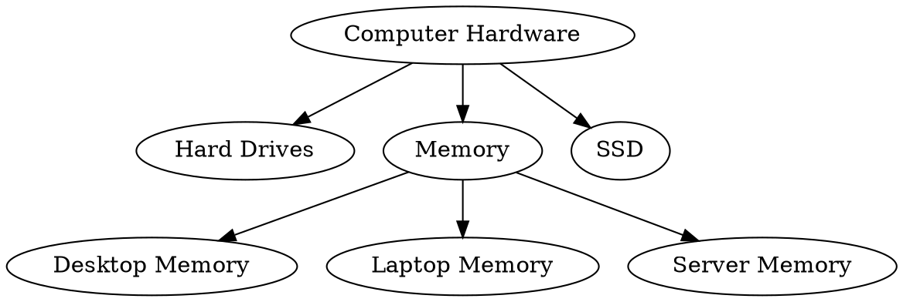

# 安装

安装依赖

```bash
uv add django-treebeard
```

将 `treebeard` 添加到 `INSTALLED_APPS`

# 快速上手（官方文档）

我们来创建一个基础的树形结构模型。本示例将使用**物化路径树（Materialized Path Tree）**实现：

```python
from django.db import models
from treebeard.mp_tree import MP_Node

class Category(MP_Node):
    name = models.CharField(max_length=30)

    def __str__(self):
        return 'Category: {}'.format(self.name)
```

## 执行并应用数据迁移

```bash
python manage.py makemigrations
python manage.py migrate
```

## 批量创建树节点

```python
from treebeard_tutorial.models import Category
get = lambda node_id: Category.objects.get(pk=node_id)

# 创建根节点
root = Category.add_root(name='Computer Hardware')
# 为根节点添加子节点
node = get(root.pk).add_child(name='Memory')
# 为当前节点添加同级兄弟节点
get(node.pk).add_sibling(name='Hard Drives')
get(node.pk).add_sibling(name='SSD')
# 为子节点继续添加下级子节点
get(node.pk).add_child(name='Desktop Memory')
get(node.pk).add_child(name='Laptop Memory')
get(node.pk).add_child(name='Server Memory')
```

> 💡 补充说明：
> 为什么每次操作后都需要**重新根据 ID 查询节点**？
> 因为 `django-treebeard` 的大部分写入操作都会使用**原生 SQL 查询**执行，
> 而原生查询不会自动更新 Django 内存中已加载的模型实例。
> 详细说明可参考官方文档：[Known Caveats — django-treebeard 5.0.5 documentation](https://django-treebeard.readthedocs.io/en/latest/caveats.html)。

## 本次创建的树形结构

 "Hard Drives"; "Computer Hardware" -> "Memory"; "Memory" -> "Desktop Memory"; "Memory" -> "Laptop Memory"; "Memory" -> "Server Memory"; "Computer Hardware" -> "SSD"; }" /> "Hard Drives"; "Computer Hardware" -> "Memory"; "Memory" -> "Desktop Memory"; "Memory" -> "Laptop Memory"; "Memory" -> "Server Memory"; "Computer Hardware" -> "SSD"; }" />



## 通过代码查看完整树形结构

### 1. dump_bulk() 批量树形数据输出

```python
Category.dump_bulk()
```

返回结果：

```json
[
    {
        "id": 1,
        "data": {"name": "Computer Hardware"},
        "children": [
            {"id": 3, "data": {"name": "Hard Drives"}},
            {
                "id": 2,
                "data": {"name": "Memory"},
                "children": [
                    {"id": 5, "data": {"name": "Desktop Memory"}},
                    {"id": 6, "data": {"name": "Laptop Memory"}},
                    {"id": 7, "data": {"name": "Server Memory"}}
                ]
            },
            {"id": 4, "data": {"name": "SSD"}}
        ]
    }
]
```

### 2. get_annotated_list() 带层级注解的列表

会自动标注节点层级、展开/闭合状态，适用于前端树形菜单渲染：

```python
Category.get_annotated_list()
```

### 3. 条件过滤树形列表

支持结合 Django 过滤条件，查询指定范围的树结构：

```python
Category.get_annotated_list_qs(Category.objects.filter(name__icontains='Hardware'))
```

---

# 定义model——物化路径树（Materialized Path trees）

---

## 一、方案概述

这是一套基于 Django 高效实现的**物化路径树**方案，设计思路参考 Vadim Tropashko 在《SQL 设计模式》中的理论。
在 SQL 场景下，物化路径几乎是**性能最优**的树形数据实现方式，无需依赖数据库高阶能力：

- 无需 Oracle 专属的 `CONNECT BY` 语法；
- 无需为嵌套区间方案编写存储过程、触发器等额外数据库逻辑。

## 二、核心原理

在物化路径设计中，树的每一个节点都会维护一个 `path` 路径字段，**完整记录从根节点到当前节点的全链路路径**。

### 优缺点

- **优势**：查询逻辑极简、执行速度极快；
- **风险**：父子外键做了反范式设计，存在数据不一致风险；
- **解决方案**：通过**数据库事务**即可完全规避该问题。

## 三、treebeard 定制化实现

`django-treebeard` 采用了专属优化方案：

1. 路径中的每一级节点固定长度，**不使用分隔符**；
2. 该设计让 SQL 查询更稳定、速度更快，代价是单级路径会占用更多字符；
3. 为节省存储空间，框架会对每一级节点编号做**编码压缩处理**。

除此之外，框架会自动为所有节点额外存储两个字段：

- `depth`：节点层级深度；
- `numchild`：直属子节点数量。

通过冗余这两个字段，**读操作性能大幅提升**，仅在节点新增、修改、删除时需要少量额外维护开销。
即便存在维护成本，物化路径的综合效率依旧优于其他树形实现方案。

> Note：全局警告
> 和所有树形结构实现方案一致，请务必查阅官方的「已知限制与注意事项」：[Known Caveats — django-treebeard 5.0.5 documentation](https://django-treebeard.readthedocs.io/en/latest/caveats.html)。

## 四、查询性能关键说明

物化路径会大量使用数据库 `LIKE` 语法，典型语句：

```sql
WHERE path LIKE '002003%'
```

常规认知中 `LIKE` 效率较低，但本方案做了关键优化：

- `path` 字段已建立数据库索引；
- 所有匹配规则**不以百分号 `%` 开头**，可以正常命中索引；
  这也是物化路径树高性能的核心原因。

---

## 五、MP_Node 类说明

### 类定义

```python
class treebeard.mp_tree.MP_Node(*args, **kwargs)
```

继承自：`Node`

**作用**：抽象模型基类，用于开发者自定义物化路径树形模型。

#### 强制警告（必看）

1. **禁止手动修改** `path` / `depth` / `numchild` 字段值，只能使用框架提供的内置方法操作，以上字段应视为只读；
2. 项目产生第一条树形数据后，**禁止修改** `steplen`、`alphabet`、`node_order_by` 配置，强行修改会直接导致树形结构损坏；
3. 若需要自定义模型管理器（Manager），必须继承 `MP_NodeManager`；
4. 若需要自定义查询集（QuerySet）逻辑，必须继承 `MP_NodeQuerySet`。

#### 代码示例

```python
class SortedNode(MP_Node):
    # 自定义节点排序规则
    node_order_by = ['numval', 'strval']

    numval = models.IntegerField()
    strval = models.CharField(max_length=255)
```

如需了解节点通用方法，可查阅 `treebeard.models.Node` 完整 API 文档：[API — django-treebeard 5.0.5 documentation](https://django-treebeard.readthedocs.io/en/latest/api.html#treebeard.models.Node)

---

## 六、核心配置属性

### 1. steplen（层级步长）

定义路径中**单一级别节点**的字符长度。

- 默认值：`4`， 单节点最多支持 $36^4 - 1 = 1679615$ 个直属子节点；
- 超大树形场景：修改为 `5`，单节点可支持 6000 万以上子节点；
- 取舍关系：增大步长会提升单节点子级容量，但会**降低树的最大层级**（默认最大层级为 63 层）；
- 拓展层级：如需更深的树结构，手动修改模型内 `path` 字段的 `max_length` 即可。

### 2. alphabet（编码字符集）

用于路径编码、进制转换的字符库。

- 默认字符集：`0123456789ABCDEFGHIJKLMNOPQRSTUVWXYZ`；
- 设计优势：全数据库兼容，适配各数据库默认排序规则，保证 `path` 有序；

#### 各数据库最优字符集


| 数据库           | 最优字符集 | 进制基数 |
| ---------------- | ---------- | -------- |
| MySQL 5.6.17     | 0-9A-Z     | 36       |
| PostgreSQL 9.3.4 | 0-9A-Za-z  | 62       |
| Sqlite3          | 0-9A-Z     | 36       |

- 框架默认采用 MySQL 兼容字符集，保证通用性；
- 若使用 PostgreSQL 等高级数据库，建议自定义字符集，提升路径存储密度；
- 高阶优化：将 `path` 字段排序规则改为纯 ASCII，使用可打印 ASCII 字符作为编码集，性能更佳。

> ⚠️ 自定义字符集警告
> 自定义字符集时，必须保证字符排序规则与数据库校对规则完全一致；
> PostgreSQL 校对规则依赖操作系统，若同时包含大小写字母，会出现跨系统排序不一致问题。

### 3. node_order_by（节点排序规则）

接收模型字段列表，用于全局定义节点排序逻辑。

- 生效范围：所有树形新增、移动、查询操作；
- 优先级：高于 Django Admin 后台拖拽排序；

### 示例

```python
node_order_by = ['field1', 'field2', 'field3']
```

> ⚠️ 注意
> 排序规则仅在节点插入、移动时生效；
> 数据库自动赋值字段（如 `AutoField`、`auto_now=True` 时间字段），若未手动传值，不会参与排序计算。

---

## 七、内置核心字段

### path

- 字段类型：`CharField`
- 作用：存储当前节点的完整物化路径；
- 默认长度：`255`，是 VARCHAR 类型兼顾性能与兼容性的最优值；
- 拓展方式：如需更深层级，可在自定义模型中重写该字段：
  ```python
  class MyNodeModel(MP_Node):
      path = models.CharField(max_length=1024, unique=True)
  ```

#### 性能优化建议

1. 数据库允许的情况下，将 `path` 字段设置为 ASCII 编码，缩小索引体积、提升查询速度；
2. MySQL InnoDB 引擎存在索引长度限制：
   - ASCII 编码：单索引最大 765 字节；
   - 通用 Unicode 编码：单索引最大 255 字符；

> 补充：`django-treebeard` 依赖 `numconv` 库完成路径编码转换。

### depth

- 字段类型：正整数字段
- 作用：标记当前节点的树层级；
- 规则：根节点 `depth = 1`。

### numchild

- 字段类型：正整数字段
- 作用：统计当前节点的直属子节点数量。

---

## 八、常用核心方法

### 1. add_root(\*\*kwargs)

**作用**：在树中新增一个根节点，自动入库保存。

- 异常抛出：`PathOverflow`（无剩余根节点可用时触发）；
- 底层逻辑：自动根据入参实例化模型并保存。

### 2. add_child(\*\*kwargs)

**作用**：为当前节点新增直属子节点，自动入库保存。

- 异常抛出：`PathOverflow`（节点子级容量耗尽时触发）。

### 3. add_sibling(pos=None, \*\*kwargs)

**作用**：为当前节点新增同级兄弟节点，自动入库保存。

- 异常抛出：`PathOverflow`（无法分配新路径位置时触发）。

### 4. move(target, pos=None)

**作用**：移动当前节点及其所有后代节点，挂载到指定目标节点的相对位置。

- 异常抛出：`PathOverflow`（路径空间不足时触发）。

### 5. get_tree(parent=None)

**作用**：获取树形结构查询集，采用**深度优先（DFS）** 排序；

- 不传参：返回完整整棵树；
- 传入父节点：仅返回该节点下所有后代；
- 返回值：原生 QuerySet，支持二次筛选、链式调用。

### 6. find_problems(parent=None)

**作用**：检测树形结构的异常问题，常见异常诱因：

- 代码异常中断，导致事务不完整；
- 运行后私自修改 `steplen` 等核心配置。

#### 检测结果（五元组列表）

1. 路径字符非法的节点 ID；
2. 路径长度与步长不匹配的节点 ID；
3. 孤立无父节点的节点 ID；
4. 层级深度与路径不匹配的节点 ID；
5. 子节点数量统计错误的节点 ID。

> 补充说明
> 单个节点只会归入一类异常，部分结构性损坏无法自动修复。

### 7. fix_tree(fix_paths=False, parent=None)

**作用**：修复因事务异常、代码错误导致的树形数据不一致问题。

#### 可修复问题

1. `depth` / `numchild` 统计值错误；
2. 频繁删除、移动节点产生的路径空洞（空洞不影响性能）；
3. 节点修改字段后导致的排序错乱。

#### 参数说明

- `fix_paths`：是否启用深度修复模式。
  - `False`（默认）：快速修复，仅修正深度、子节点数；
  - `True`：全量重建路径，速度慢，可修复排序、路径空洞问题；
- `parent`：指定范围，仅修复目标节点下的子树。

---

## 九、内置管理器

### MP_NodeManager

`treebeard.mp_tree.MP_NodeManager`
专为物化路径树定制的模型管理器，继承自原生 `Manager`。

### MP_NodeQuerySet

自定义查询集类，核心用途：重写删除逻辑，保证树形删除时的数据联动一致性。

# 配置 Admin

## API 参考

### class treebeard.admin.TreeAdmin(model, admin_site)

**基类：** ModelAdmin

专为 treebeard 设计的 Django 管理后台类。

**使用示例：**

```python
from django.contrib import admin
from treebeard.admin import TreeAdmin
from treebeard.forms import movenodeform_factory
from myproject.models import MyNode

class MyAdmin(TreeAdmin):
    form = movenodeform_factory(MyNode)

admin.site.register(MyNode, MyAdmin)
```

---

### treebeard.admin.admin_factory(form_class)

基于指定的表单类，动态构建 TreeAdmin 子类。

**参数：**

- form_class：表单类

**返回值：**
TreeAdmin 子类

---

## 交互界面

管理后台的功能特性，取决于所使用的树形结构类型。

### 高级交互界面

物化路径（Materialized Path）和嵌套集（Nested Sets）类型的树形结构，提供基于 FeinCMS 构建的 AJAX 交互界面，支持拖拽排序等功能，界面美观易用。


### 基础交互界面

邻接表（Adjacency List）类型的树形结构，仅提供基础的管理后台界面。


---

## 模型详情页

如果修改了模型的字段配置，**必须**在列表展示项中添加 `treebeard_position` 和 `treebeard_ref_node_id` 两个字段，否则将无法创建该模型的实例。

**使用示例：**

```python
class MyAdmin(TreeAdmin):
    list_display = ('title', 'body', 'is_edited', 'timestamp', 'treebeard_position', 'treebeard_ref_node_id',)
    form = movenodeform_factory(MyNode)

admin.site.register(MyNode, MyAdmin)
```

---

## 外键与一对一关系

如果你的项目中，有模型与树形模型存在外键或一对一关联关系，可以使用 `TreeNodeChoiceField` 字段，在 Django 管理后台中友好地展示树形选项。

示例模型定义如下：

```python
class TreeNode(MP_Node):
    ...

class RelatedModel(models.Model):
    tree_node = models.ForeignKey("TreeNode", on_delete=models.CASCADE)
```

你可以按如下方式配置 `RelatedModel` 的管理后台表单，让 `tree_node` 字段的选项以嵌套列表的形式渲染：

```python
class RelatedModelAdminForm(forms.ModelForm):
    tree_node = TreeNodeChoiceField(queryset=TreeNode.objects.all())

class RelatedModelAdmin(admin.ModelAdmin):
    form = RelatedModelAdminForm

admin.site.register(RelatedModel, RelatedModelAdmin)
```

> ⚠️ **警告**
> `TreeNodeChoiceField` 不可用于邻接表（AL）类型的节点，因为在该场景下，这类节点无法实现高效查询。

# 使用优化

TODO
